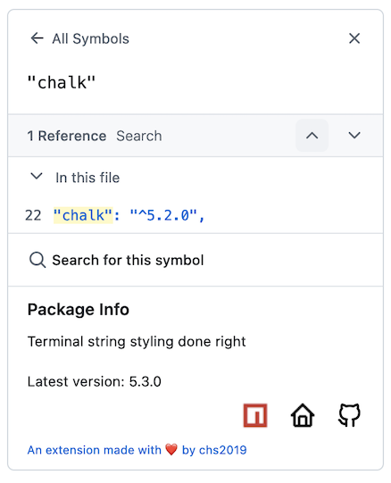

# Easily inspect package.json dependencies

**tldr;**

This extension makes inspecting dependencies in **package.json** files on **GitHub** faster and more convenient.

## Why?

I like browsing package.json files for projects I come across, to learn about useful packages and best practices. For package names I don't recognise it has been a bit inconvenient to copy the name and look them up on npm and/or GitHub. 

Most often I am interested in a short **description** of the and the referenced version compares to the **latest available version**, this is information immediately shown. More is accessible through links.

## What?

The extension works when browsing a **package.json** file on **GitHub**. It appends a **Package Info** section to GitHub's symbol pane like so:

Dependencies added to package.json using github or workspace locators are omitted for simplicity. 

## How?

The package info section immediately displays a **link to the [npm page](https://www.npmjs.com/)** for the dependency, loads the dependency's **description** and latest **version number** using the [npm registry API](https://registry.npmjs.org/), and (if applicable) **links the project's homepage** and the **GitHub repo**.